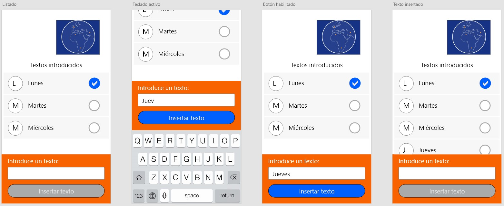

# Prueba técnica Xamarin Android #
El objetivo de la prueba es resolver un problema donde se va a valorar los siguientes conocimientos del candidato:

1. Conocimientos de las clases nativas relacionadas con el desarrollo de las vistas de la aplicación en la plataforma Xamarin Android.
2. Conocimientos de las clases relacionadas con la implementación de listas y celdas.
3. Conocimientos de integración de librerías nativas en un desarrollo Xamarin.
4. Conocimientos del patrón MVVM.

La prueba estará disponible en un repositorio de Github. El candidato, una vez finalice la prueba, deberá hacer un **Pull Request** de la misma para su valoración.

## Definición del problema ##

Se quiere una aplicación en Xamarin Android que va a consistir en una única pantalla. La funcionalidad principal es la de mostrar una lista de palabras en pantalla, además de permitir al usuario que inserte nuevos elementos en ella.  
Adicionalmente, los elementos de la lista se podrán seleccionar con el dedo mostrando un checkbox sobre el último seleccionado. Es decir, a lo sumo sólo puede haber una palabra seleccionada. Si pulso sobre una entrada ya seleccionada, esta se deselecciona.

Esta prueba no requiere que los elementos de la lista se puedan borrar o modificar. Tampoco es necesario implementar funcionalidad para almacenar los datos introducidos en repositorios, ficheros ni bases de datos.

Se debe tener en cuenta que la aparición del teclado en pantalla no oculte el cuadro de texto. Así el usuario podrá ver el texto que está introduciendo.

Estas pantallas son unicamente a modo de guía. No es necesario que el candidato siga el diseño teniendo en cuenta el tamaño exacto de los elementos, fuentes ni códigos de color mostrados.

## Otras especificaciones ##

Se desea que la imagen de la parte superior sea una animación en formato _lottie_. Se adjunta en el repositorio el fichero en formato json. El ancho de la imagen debe ser del 40% de la pantalla. Y debe colocarse centrado en la parte derecha de la pantalla. Es decir, si la pantalla la dividimos en dos columnas, pondremos la imagen centrada en la columna de la derecha.

A continuación vendrá la lista de nombres que ocupará todo el espacio disponible en pantalla hasta el panel de entrada de datos. Si se insertan más elementos de los que visualmente caben en la lista, debe proporcionar funcionalidad de scroll. Pero siempre teniendo en cuenta que la animación y el botón con el cuadro de texto deben permancer fijos.  
Las celdas tendrán un formato de 3 columnas:
- La parte izquierda tendrá un círculo con la primera letra del texto.
- La parte derecha tendrá el control con el checkbox.
- La parte central ocupará todo el resto de la celda y contrandrá el texto introducido por el usuario.

La parte inferior de la pantalla estará fija y consistirá en un cuadro de texto y un botón. Al pulsar el botón se añadirá el contenido del cuadro de texto a la lista siempre y cuando este tenga algún dato. Después de insertar el texto, el contenido del cuadro se vaciará.  
Se valorará que si el cuadro de texto está vacío, el botón no esté habilitado y no permita la inserción.

Es importante que se utilice el patrón MVVM en el desarrollo de esta prueba para valorar los conocimientos del mismo. Como ayuda, se propone utilizar algún framework para este patrón como por ejemplo MvvmLight, FreshMvvm, Prism, etc., aunque se valorará que se utilice el framework de MvvmCross que es el que actualmente usamos en nuestros proyectos. Si el candidato no tiene conocimientos de este framework o de los otros, podrá montar su propia infraestructura de clases desde cero.

No se proporciona ningún proyecto ni solución inicial. El candidato tendrá que crear la solución desde cero. Se entiende que al menos tendrá un proyecto para la parte común con los _models_ y los _view models_ y otro proyecto para la plataforma Android con las vistas.

Se desa valorar la capacidad de crear vistas parciales que puedan ser reutilizables en otras partes de la aplicación. Para ello, se pide que el bloque con el cuadro de texto y el botón esté dentro de una clase que herede de `Fragment` (por ejemplo, `InputFormFragment`) para poder ser reutilizada. 

## Otros puntos de consideración ##

Se tendrá muy en cuenta el estilo de codificación y buenas prácticas. Que sea fácil de leer y entender por otro desarrollador. A modo de guía se facilitan algunas recomendaciones dadas por Microsoft:
- [Convenciones de nombrado](https://docs.microsoft.com/es-es/dotnet/csharp/programming-guide/inside-a-program/identifier-names)
- [Convenciones de codificación](https://docs.microsoft.com/es-es/dotnet/csharp/programming-guide/inside-a-program/coding-conventions)

No será necesario el uso de test unitarios en esta prueba dado que el objetivo principal es ver los conocimientos de Xamarin Android del candidato.